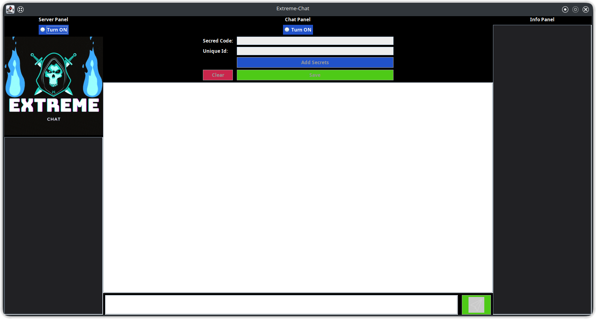
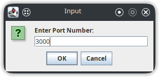
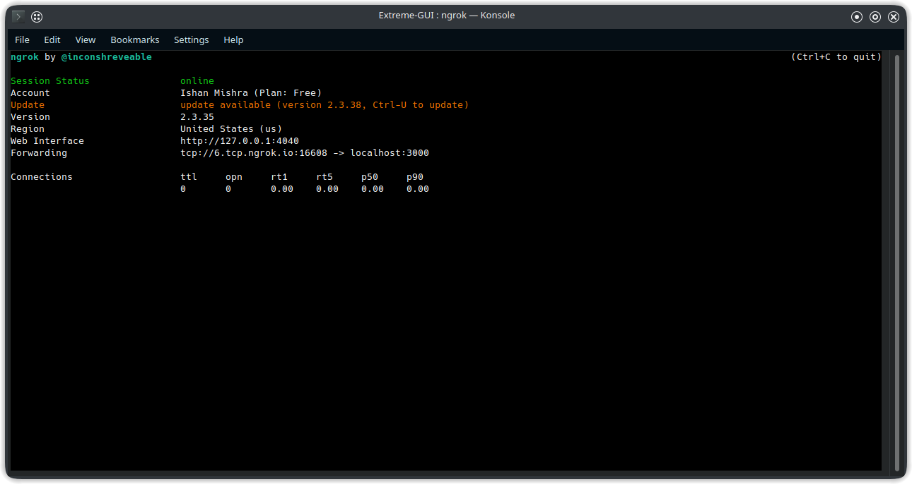
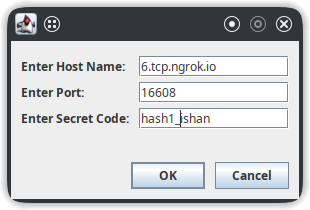
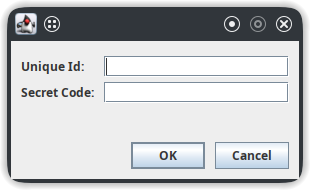
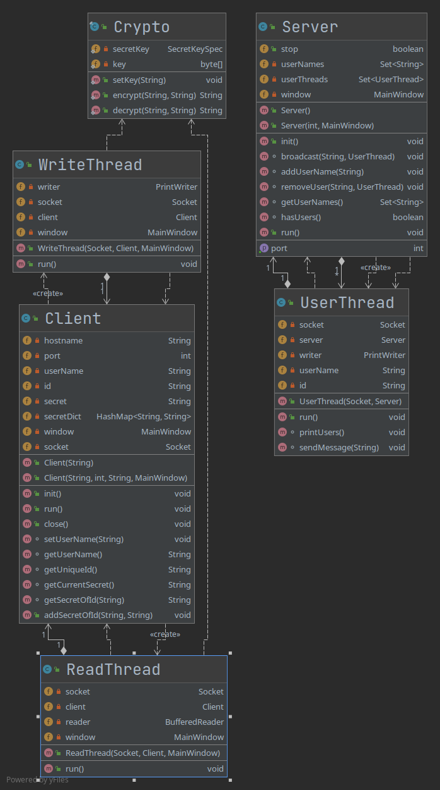
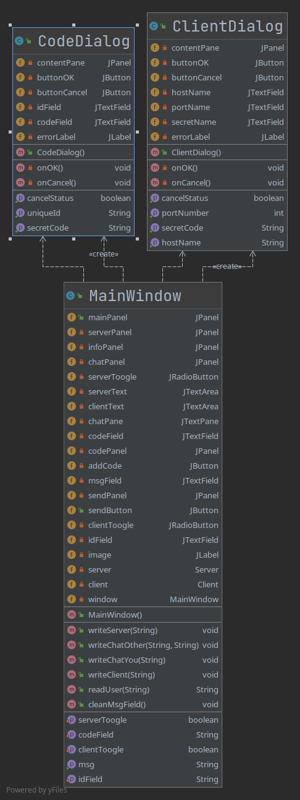

<h1 align="center">
  Extreme-Chat
</h1>

<h2 align="center">
  Don't Be an Open-Book
</h2>

### Idea:
In this modern age, everyone is connected through the internet. Facebook, WhatsApp, Instagram, etc... are doing their act of delivering the message from one person to another effectively. But all these fails when it comes to keeping the data private, it’s always on the news that about the user data being leaked. Although this may not be a problem for many users as they consider themself an “Open Book” but few who want to keep their life private wants a better solution to this. From our small project we are trying to  contribute towards this goal.

### Features:
* Creat a chat server for group chatting.
* None of the data is stored in any cloud database.
* End-to-End encryption through AES crypto algorithm. 
* Sharing of secret key to give access to other users to read the chat.
* Information Panels to get info when a new user gets connected.
* Save button to save the chat data in form of JSON file.

### How to use?
**Step-1**: Download the .jar file from [here](https://github.com/ishanExtreme/Extreme-Chat-2/blob/master/setup/V1/Executable.jar). 
**Step-2**: To run the file, JRE must be installed. See the instructions [here](https://docs.oracle.com/goldengate/1212/gg-winux/GDRAD/java.htm#BGBFJHAB) 
**Step-3**: Run the .jar file, (**note to run on linux distros, check *is executable* checkbox in properties of the file under *permissions* tab**) 
**Step-4**: Following screen will appear.

    

**Step-5**: Turn on the server and enter any free port (ex->3000) and click *OK*.

    

**Step-5**: (*For connecting systems over internet*)

* Download and Setup ngrok, [see here](https://ngrok.com/download).
* Create and connect ngrok account.
* Run the following command in terminal `*ngrok tcp 3000*`, **replace 3000 with the port number entered while creating server**.
* Forwarding link will be used for connecting with server over internet.

    

**Step-6**: Turn on Chat Panel and enter hostname, port and secret code.

* In hostname exclude *tcp://* from forwarding link
* Use port number from forwarding link and not the localhost one(example in image below).
* Secret code is used to decrypt the chat on other clients, you can enter any random word here, and click *OK*.

    

* All the information regarding connected users can be seen on the right *Info Panel*, and server(if made) can be seen on left *Server Panel*

**Step-7**: Share the hostname and port of ngrok forwarding link to other users, in order to connect with server(they don't require to turn on the server).

**Step-8**: By this time conversation can be started but the messages will be in encrypted format to decrypt message of a particular user, get his/her secret code and unique Id and enter it by pressing *Add Secrets*.

    

    

**Step-9**: To clear chat on your side press *Clear* button.

**Step-10**: To save the chat press *Save* button. It will create a json file in the current directory.

### Implementation Details:

* Package backend:

    

    Class Descriptions:

    Crypto: Used for encoding and decoding messages through AES algorithm. 

    Server: Waits for the client to connect and starts the UserThread. 

    UserThread: Separate thread for each client connected, it stores client's data and broadcast messages to other clients. 

    Client: Used to create a client than starts two new thread, ReadThread and WriteThread. 

    WriteThread: When “Send” button is clicked it reads data from the user and encrypt it and write it to socket OutputStream. 

    ReadThread: Reads the broadcasted message and decrypt it if key is found, and write the decrypted message to the ChatPanel.

* Package frontend:

    

    Class Description:

    Main Window: Contains GUI for the Main screen of the APP. 

    CodeDialog: Dialog box to add secretID and uniqueID of a client. It also contains validation logic. 

    ClientDialog: Dialog box to add Client information. It also contains validation logic.

### Future Addons/Possible Contributions:

* Feature to upload chat data to different cloud services and databases(🤔) in just one click.
* Emoji Section to send emoji.
* Email button to send secret key via email to other users(Beginner's Friendly 🙂).
* Feature to change secret code on the fly ✈️.
  
 
 
<h2 align='center'>
  Do star ⭐ the repo if you like the project
</h2>

  

